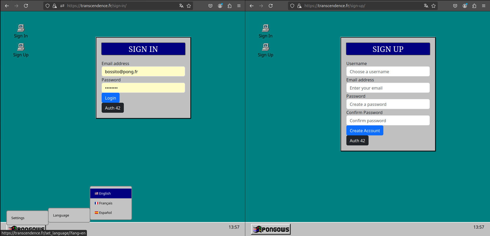
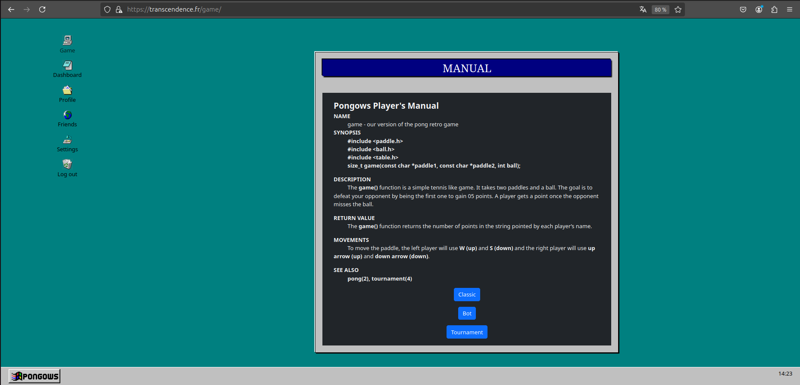
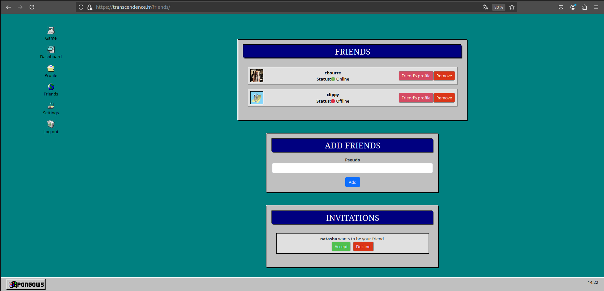

# ft_transcendence

The project `ft_transcendence` is about creating a website for the mighty Pong contest! Thanks to our website, users will play Pong with others. We had to provide a nice user interface and real-time multiplayer online games!

Mates: **mafissie**, **slepetit**, **ajoliet** and **arforgea**

Score: **105%**

## Modules

For this project, we must achieve 7 majors (2 minors = 1 major). Here are the one we made (7.5) :

- Web

         - Use a Framework as backend -> Django (major)
         - Use a front-end framework or toolkit -> Bootstrap (minor)
         - Use a database for the backend -> Postgresql (minor)

- User Management
  
         - Standard user management, authentication, users across tournaments (major)
         - Implementing a remote authentication (major)

- AI-Algo

         - Introduce an AI Opponent (major)
         - User and Game Stats Dashboards (minor)

- Accessibility

         - Support on all devices (minor)
         - Expanding Browser Compatibility (minor)
         - Multiple language supports -> en, fr, es (minor)
         - Server-Side Rendering (SSR) Integration (minor)

## Frames' preview

Sign in / Sign up frames:



Game frame:



Friends frame:




## Installation

To use `ft_transcendence`, simply clone the repository and compile it on your own VM:
   ```bash
   git clone https://github.com/username/ft_transcendence-42.git
   cd ft_transcendence-42
   make
  ```

## Usage

Normally the program should not run because it is missing the `.env` file. For security reasons: you should not put personnal informations as IDs, keys API or env variables.

Configure the services by editing your `.env` file and join it to the project. If it still doesn't work, make sure you install all the depedencies.

After all this manipulations, you'll be able to launch the project:
   ```bash
   make
  ```
To access the website, go in the browser at `https://localhost` or `https://transcendence.fr`.

Have fun !
